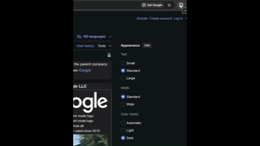
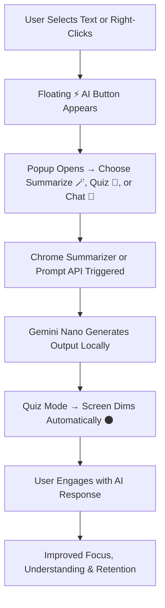

# 🧠 BrainByte — Learn Smarter, Not Harder  
> ✨ *Your all-in-one Chrome AI companion for summarizing, quizzing, and chatting — right from any webpage.*

-green?style=flat-square)

---

## 📘 Overview
**BrainByte** is an AI-powered Chrome extension that transforms any webpage into an interactive learning environment.  
With one click, users can:
- 🪄 Get **instant AI-generated summaries**,  
- 🧩 Take **auto-generated quizzes** with screen dimming for focus, or  
- 💬 **Chat** with Chrome’s built-in Gemini Nano about the selected content.  

It’s built for students, researchers, and lifelong learners who want to **comprehend and retain knowledge faster**, directly from their browser.

---

## 🎯 Quick Pitch
> “What if every webpage could teach you something — in seconds?”

That’s **BrainByte** — your minimalist, orange-themed Chrome AI extension that:
- Summarizes any selected text using Chrome’s **Summarizer API**  
- Generates instant quizzes using the **Prompt API**  
- Launches a **built-in chatbot** for contextual learning  
- Displays a **floating AI button** near your text selection 🟠  
- **Dims your screen** automatically during quizzes for deep focus 🌑  
- Runs **entirely on-device** using **Gemini Nano**, ensuring privacy and offline use  

---

## 🚀 Why BrainByte?

| Problem | Solution |
|----------|-----------|
| Endless reading, low retention | One-click summaries for instant clarity |
| Passive reading habits | Engage with interactive AI-generated quizzes |
| Hard to focus while testing | Automatic screen dimming during quizzes |
| Tedious switching between apps | Floating **AI button** integrates actions seamlessly |
| Disjointed learning experiences | Summarize, quiz, and chat — all in one popup |
| Online distractions | Works offline with Gemini Nano for uninterrupted learning |

---

## 🧩 Demo / Screenshots

| Action | Preview |
|--------|----------|
| 🟠 Select text → Floating “AI” button appears |  |
| ⚡ Click “Summarize” → instant summary popup |  |
| 💬 Switch to Chat tab → context-aware chat |  |
| 🧠 Click “Generate Quiz” → interactive quiz overlay |  |
| 🌑 Auto-dim screen during quiz |  |

---

## 🧱 Tech Stack & Architecture

| Layer | Technology |
|--------|-------------|
| **Frontend** | HTML, CSS, Vanilla JS (Material 3 inspired UI) |
| **Browser APIs** | Chrome Summarizer API, Prompt API |
| **AI Engine** | Gemini Nano (on-device AI) |
| **Content Script** | Detects text selection, injects AI button |
| **Background Script** | Handles context menus & message routing |
| **Popup UI** | Tab-based interface (Summary / Quiz / Chat) |
| **Permissions** | `activeTab`, `contextMenus`, `scripting` |

---

## 🧭 How It Works

---

## 🌟 Why It Stands Out (Google Hackathon)

| Highlight | Description |
|------------|--------------|
| 🧠 **Three-in-One AI Tool** | Summarizer, Quiz Generator, and Chatbot — all integrated. |
| ⚡ **Floating AI Trigger** | Contextual button enhances usability. |
| 🌑 **Smart Focus Mode** | Auto-dimming for distraction-free quizzes. |
| 💬 **Gemini Nano Chat** | On-device AI for real-time contextual learning. |
| 🧱 **Privacy-First Local AI** | Runs offline with no external API calls. |
| 🟠 **Google-Themed UI** | Inspired by Material Design 3. |
| 🧩 **Open Source Project** | Built for community-driven innovation. |

---

## 🔮 Future Roadmap

- 🗣️ **Voice-Based Interaction** – Ask questions and hear responses  
- 📊 **Personalized Quiz Difficulty** – Adaptive learning system  
- 🧠 **Progress Tracking** – Save quiz results and summaries  
- 🤝 **Collaborative Learning Mode** – Share notes & quizzes  
- 🎨 **Custom Themes** – Light, Dark, and Focus modes  

---

## 🤝 Contributing

BrainByte is **open source** and welcomes contributions!  
1. Fork the repository  
2. Create a feature branch  
3. Submit a pull request  

> Together, let’s build the smartest AI-powered learning companion for the web 🌐  

---

## 🧩 License
This project is licensed under the **MIT License** — free to use, modify, and distribute.

---

### ✨ *BrainByte — Turning every webpage into a personal tutor.*
