# 🧠 QuiSum — Smart Summarize + Quiz  
> ✨ *Learn faster, retain better — directly from any webpage.*

-green?style=flat-square)

---

## 📘 Overview
**QuiSum** is a smart Chrome extension that transforms your reading experience by instantly turning any selected text into:
- 🪄 a **concise AI-generated summary**, or  
- 🧩 an **interactive multiple-choice quiz**,  
- 💬 or even a **chat-based learning session** powered by Chrome’s built-in AI.

It helps students, researchers, and curious minds **learn actively** instead of passively consuming content — all *within the same tab*.

---

## 🎯 Quick Pitch
> “What if you could summarize, quiz, or chat with any paragraph using just one click?”

That’s **QuiSum** — a minimal, orange-themed, AI-powered Chrome extension that:
- Extracts meaning using Chrome’s **Summarizer API**
- Generates quiz questions using **Prompt API**
- Opens a **chat mode** for deeper learning  
- Adds a **floating AI button** right next to your selected text 🟠  
- Dims your screen automatically during quizzes for laser-focus 🌑  
- And works perfectly via **right-click → “Summarize / Quizify”**

---

## 🧩 Demo / Screenshots

| Action | Preview |
|--------|----------|
| 🟠 Select text → Floating “AI†button appears near selection |  |
| ⚡ Click “Summarize†→ instant summary in popup |  |
| 💬 Switch to Chat tab → ask context-aware questions |  |
| 🧠 Click “Generate Quiz†→ interactive quiz overlay |  |
| 🌑 Auto-dim screen during quiz for distraction-free learning |  |

*(Replace demo GIFs/screenshots once available.)*

---

## 🚀 Why QuiSum?

| Problem | Solution |
|----------|-----------|
| Reading long articles is time-consuming | One-click summarization powered by Chrome AI |
| Passive learning = poor retention | Turn any text into an engaging quiz instantly |
| Hard to stay focused while testing knowledge | Auto-dim screen during quiz for better concentration |
| Need quick access | Floating “⚡AI” icon appears instantly when text is selected |
| Prefer traditional menu actions | Also works with **right-click → Summarize / Quizify** |
| Want deeper understanding | Switch to the **Chat tab** for AI-driven explanations |

---

## 💡 Key Features

✅ **Instant Summaries** – Condense any selected text into key bullet points  
✅ **AI-Generated Quizzes** – Interactive MCQs with randomized correct options  
✅ **Floating AI Button** – Appears near selected text for quick actions  
✅ **Context Menu Integration** – Right-click → Summarize / Quizify  
✅ **Chat Mode** – Conversational learning experience inside popup  
✅ **Screen Dimming Mode** – Dark overlay activates during quiz for full focus  
✅ **Material Design UI** – Clean orange-accented layout (Google Material 3)  
✅ **Privacy-First** – No data tracking, all AI runs locally in Chrome  
✅ **Offline Ready** – Works with **Gemini Nano** (Chrome’s local AI model)

---

## 🧭 How It Works

1. **Select any text** on a webpage  
2. A **floating orange “⚡AI” button** appears beside the selected text  
3. Click it to open the QuiSum popup  
4. Choose one of three actions:  
   - 🪄 **Summarize** → get concise points instantly  
   - 🧩 **Quizify** → take an AI-generated quiz  
   - 💬 **Chat** → converse with Chrome AI about the content  
5. During quiz mode:  
   - 🌑 **Screen darkens** for distraction-free learning  
   - 🧠 Questions appear with randomized options  
6. Return to normal view or switch tabs anytime  

---

## 🧱 Tech Stack & Architecture

| Layer | Technology |
|--------|-------------|
| **Frontend** | HTML, CSS, Vanilla JS (Material Design-inspired UI) |
| **Browser APIs** | Chrome AI Prompt API, Chrome Summarizer API |
| **Content Script** | Detects text selection, injects floating AI button |
| **Background Script** | Handles right-click actions and popup triggering |
| **Popup** | Displays results, chat UI, and quiz interface |
| **Permissions** | `activeTab`, `scripting`, `contextMenus` |

## 🧩 System Flow

```mermaid
graph TD;
    A[User Selects Text] --> B[Floating ⚡ AI Button Appears];
    B --> C[Popup Triggered → Summarize, Quiz, or Chat];
    C --> D[Chrome Summarizer or Prompt API];
    D --> E[Render Output in Popup];
    E --> F[Quiz Mode Activates Dark Overlay];
    F --> G[User Interacts on Focused Screen];
    G --> H[Enhanced Learning & Retention];
```

## 🌟 Why It Stands Out (for Google Hackathon)

| Feature | Description |
|----------|--------------|
| 🧠 **Three-in-One Chrome AI Experience** | Summarize, Quiz, and Chat with any webpage content seamlessly. |
| 🟠 **Floating AI Button (Floater Icon)** | Appears contextually near selected text for an intuitive and fast user experience. |
| 🌑 **Automatic Screen Darkening** | Dims the background during quizzes for improved focus and reduced distractions. |
| 💬 **Built-in Chat Mode** | Enables interactive, context-aware explanations powered by Chrome’s on-device AI. |
| 🧩 **Right-Click Integration** | Quickly access all features via the context menu without extra navigation. |
| 🧱 **Material Design 3 UI** | Polished, responsive design that aligns with Google’s design principles. |
| ⚙️ **Local Processing** | Works offline using Chrome’s Gemini Nano AI model — ensuring data privacy. |
| 🚀 **Optimized for Focused Learning** | Reduces cognitive load by keeping all learning tools within one workflow. |

---

## 🔮 Future Improvements

- 🗣️ **Voice Interaction** — Talk to QuiSum and learn hands-free  
- 🧮 **Adaptive Quiz Difficulty** — Smart question scaling based on performance  
- 🧠 **Learning History & Analytics** — Track progress, revisit weaknesses  
- 🤝 **Collaborative Study Groups** — Share AI-generated quizzes or summaries with friends  
- 🪶 **Theme Personalization** — Choose from Light, Dark, or Orange-Pro themes  

